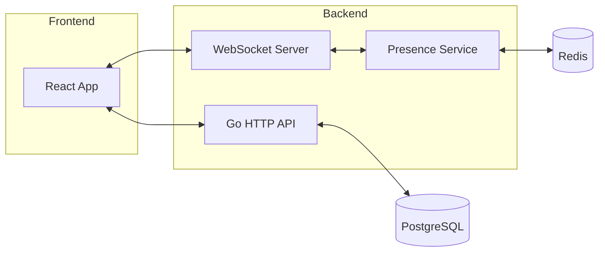
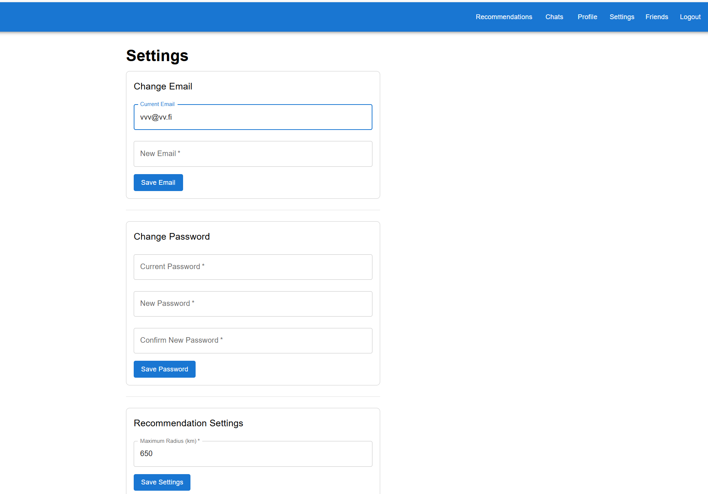

# Match Me - Meeting Application

**Match Me** is a social app for finding new friends with similar interests. The recommendation system suggests users based on shared hobbies, music, food, travel preferences, and the "Looking For" field. The top 10 recommendations are selected by profile similarity and proximity, prioritizing users who match your interests and are geographically closer.

To start a real-time chat, you first need to send a connection request to a recommended user. Once the user accepts your request, a real-time chat becomes available and messages are delivered instantly.

> *(See below for technical details and setup instructions.)*

## Final review branch

The final version for review is in the branch **final**.

## Architecture Overview


*System architecture: React frontend, Go backend, WebSocket server, Redis, PostgreSQL.*

## Table of Contents

- [Requirements](#requirements)
- [Installation and Setup](#installation-and-setup)
- [Project Structure](#project-structure)
- [API and Ports](#api-and-ports)
- [Development](#development)
- [Setting Recommendation Radius](#setting-recommendation-radius)
- [Database Reset and Dummy User Generation](#database-reset-and-dummy-user-generation)
- [Registration and Authentication](#registration-and-authentication)
- [Recommendation Algorithm](#recommendation-algorithm)
- [FAQ & Troubleshooting](#faq--troubleshooting)
- [Environment Variables](#environment-variables)
- [Security](#security)


## Requirements

- **Node.js** (v16+)
- **Docker** and **Docker Compose**
- **PostgreSQL**
- **Redis** (v7+)

## Installation and Setup

### Automatic Installation (Recommended)

1. Clone the repository:
   ```bash
   git clone https://[repo link]
   
   ```

2. Run the setup script:
   ```bash
   npm run all
   ```
   The script will automatically configure everything needed: install Docker (if missing), create PostgreSQL and Redis containers, install dependencies for both backend and frontend.

4. After installation is complete, start the application:
   ```bash
   npm run dev
   ```

5. Open the application in your browser:
   - Frontend: [http://localhost:3000](http://localhost:3000)
   - Backend API: [http://localhost:8080](http://localhost:8080)

### Manual Installation

If automatic installation doesn't suit your needs, perform these steps manually:

1. Install Docker and Docker Compose
2. Start PostgreSQL and Redis:
   ```bash
   docker compose up -d db redis
   ```
3. Install backend dependencies:
   ```bash
   cd backend
   
   go mod tidy
   go run main.go -deps
   cd ..
   ```
4. Install frontend dependencies:
   ```bash
   cd frontend
   npm install
   npm start
   cd ..
   ```
5. Start the application:
   ```bash
   npm run dev
   ```

**Note:** Redis is started automatically with Docker Compose. If running services separately, ensure Redis is running and accessible at the address specified in `REDIS_URL`.

### Docker Installation

For setting up Docker on different operating systems, follow these steps:

1. **Windows**:
   - Install Docker Desktop from the [official website](https://www.docker.com/products/docker-desktop).
   - Enable WSL2 integration in Docker Desktop settings.
   - Start Docker Desktop to use Docker in WSL2.

2. **macOS**:
   - Install Docker Desktop for Mac from the [official website](https://www.docker.com/products/docker-desktop).
   - Start Docker Desktop to use Docker in the terminal.

3. **Linux**:
   - Install Docker using your distribution's package manager (e.g., `apt` for Ubuntu).
   - Ensure Docker is running as a daemon.
   - Use Docker commands in the terminal as usual.

## Features

- Real-time chat and notifications (WebSocket)
- Online presence tracking (Redis)
- Instant user notifications (React Toastify)
- JWT authentication
- Dockerized setup
- An offline/online indicator is shown on profile and chat views.
- Batch Presence API: Efficiently check online status for multiple users
- Real-time Notifications: Instant updates for chat and social features via WebSocket and Redis
- Image Upload: Support for avatars and media content
- Data Validation: Strict validation of input data
- CORS: Configured security for cross-domain requests

## Technologies

### Backend:
- **Go** - main development language
- **Gorilla Mux** - HTTP router
- **Gorilla WebSocket** - WebSocket support
- **GORM** - ORM for database operations
- **JWT** - user authentication
- **PostgreSQL** - data storage
- **Redis** - in-memory store for online presence and real-time features

### Frontend:
- **React** - UI library
- **React Router** - routing
- **Material UI** - interface components
- **Formik** and **Yup** - form management and validation
- **Axios** - HTTP client
- **React Toastify** - notifications

### Infrastructure:
- **Docker** and **Docker Compose** - containerization
- **Redis** (v7+) - required for presence and real-time features (auto-started via Docker Compose)
- **Concurrently** - parallel service execution

## Project Structure

```
match-me/m
├── backend/              # Go server
│   ├── config/           # Configuration
│   ├── controllers/      # API controllers
│   ├── db/               # Database settings
│   ├── middleware/       # Middleware (auth, etc.)
│   ├── models/           # Data models
│   ├── routes/           # API routes
│   ├── services/         # Business logic (recommendations, presence, etc.)
│   │   └── presence.go   # Online presence logic (Redis)
│   ├── sockets/          # WebSocket handlers (real-time chat, notifications)
│   ├── static/           # Static files (images)
│   ├── utils/            # Helper functions
│   ├── go.mod            # Go dependencies
│   └── main.go           # Entry point
├── frontend/             # React application
│   ├── public/           # Static files
│   ├── src/              # React source code
│   ├── package.json      # NPM dependencies
│   └── package-lock.json # NPM lock file
├── docker-compose.yml    # Docker configuration (PostgreSQL, Redis)
├── package.json          # Root NPM scripts
└── setup.sh              # Setup script
```

## API and Ports

- **3000** - Frontend (React)
- **8080** - Backend API (Go)
- **8081** - WebSocket server
- **5433** - PostgreSQL
- **6379** - Redis

## Development

### Available Scripts

```bash
# Full installation
npm run all

# Run the entire application
npm run dev

# Database only
npm run dev:db

# Redis only
npm run dev:redis

# Backend only
npm run dev:backend

# Frontend only
npm run dev:frontend
```

### Working with the Database and Redis

To access PostgreSQL:

```bash
docker exec -it m_postgres psql -U user -d sopostavmenya
```

To access Redis CLI:

```bash
docker exec -it m_redis redis-cli
```

## Setting Recommendation Radius

To search for recommendations within a specific geographical radius, navigate to the "Settings" page of the application. At the bottom of the settings page, you will find an option to set the maximum radius for recommendations. Adjusting this value enables proximity-based filtering for recommendations.


*Screenshot: Where to set the maximum recommendation radius in the Settings page*

## Database Reset and Dummy User Generation

These features are available only to the administrator via the admin panel in the frontend.

- To access the admin panel, register first and then log in with AdminEmail and the AdminPassword (specified in `config/constants.go`).
- The admin panel provides buttons for database reset (`/admin/reset-fixtures`) and dummy user generation (`/admin/generate-fixtures?num=N`).
- When resetting the database, the admin user is created automatically using the config data.

## Registration and Authentication

- Email must be in the format: example@domain.com
- Password must be at least 8 characters and contain both letters and numbers or special characters.
- After registration, fill in your profile completely to enable recommendations.

## Recommendation Algorithm

The recommendation system supports two independent modes:
- **Affinity**: Matches users by profile similarity (interests, hobbies, music, food, travel), with customizable field priorities.
- **Desire**: Matches users by the 'LookingFor' field (custom search).

**How it works:**
1. Only users within your preferred radius are considered (fast geospatial filtering via PostgreSQL earthdistance/cube).
2. Each candidate is scored by the overlap of profile fields. Each match gives +2%, priority match +4%. The score is capped at 100%.
3. Declined users and incomplete profiles are excluded.
4. Recommendations are sorted by distance (nearest first), then by match score (highest first).
5. The system is extensible: new fields and weights can be added by developers.

**Tip:** Set your search radius in Settings (recommended: 500–1000 km) and fill out your profile completely for best results.

_For developers: see the architectural comment in `backend/services/recommendations.go` for implementation details and extension points._

## FAQ & Troubleshooting

- If you do not see any recommendations, check that your profile is complete (name, city, bio, interests, etc.) and your search radius is set (recommended: 500–1000 km). 
- If your radius is too small or your profile is incomplete, you may not receive any matches.
- If you encounter errors during registration or login, make sure your email and password meet the requirements.
- For database reset or test user generation, use the admin panel (see instructions above).

## Environment Variables

Before running the application, ensure that the following environment variables are properly configured. These variables control ports, database connections, JWT secrets, Redis, and other essential settings. Update these variables in your `config_local.env` file according to your local setup.

| Name                | Default           | Description                                      |
|---------------------|-------------------|--------------------------------------------------|
| SERVER_PORT         | 8080              | Backend server port                              |
| WEBSOCKET_PORT      | 8081              | WebSocket server port                            |
| DATABASE_URL        | postgres://...    | PostgreSQL connection string                     |
| JWT_SECRET          | verysecretkey     | JWT signing secret                               |
| JWT_EXPIRES_IN      | 60                | JWT expiration (minutes)                         |
| JWT_REFRESH_EXPIRES_IN | 10080           | Refresh token expiration (minutes)               |
| MEDIA_UPLOAD_DIR    | ./static/images   | Directory for uploaded images                    |
| ENVIRONMENT         | development       | Environment mode                                 |
| ALLOWED_ORIGINS     | ...               | Allowed CORS origins (comma-separated)           |
| LOG_LEVEL           | debug             | Logging level                                    |
| REDIS_URL           | localhost:6379    | Redis connection string                          |
| REDIS_TIMEOUT       | 5                 | Redis connection timeout (seconds)               |
| RECOMMENDATIONS_LIMIT | 10              | Max recommendations per request                  |
| POSTGRES_USER       | user              | PostgreSQL user                                  |
| POSTGRES_PASSWORD   | password          | PostgreSQL password                              |
| POSTGRES_DB         | sopostavmenya     | PostgreSQL database name                         |
| DB_PORT             | 5433              | PostgreSQL port                                  |

## Security

- **Authentication:**
  - JWT tokens are used for stateless authentication.
  - Passwords are securely hashed with bcrypt and a unique salt per user.
  - Refresh tokens are supported for session renewal.
- **Authorization:**
  - All sensitive endpoints require authentication.
  - Users can only access their own data or data they are allowed to see.
  - User endpoints return HTTP 404 if the resource is not found or access is denied (prevents distinguishing between "not found" and "forbidden").
- **WebSocket:**
  - WebSocket connections require a valid JWT for handshake.
  - All real-time events are scoped to authenticated users.
- **Redis:**
  - Used only for presence (online status), does not store sensitive data.
  - No direct user access to Redis.
- **CORS:**
  - Only allowed origins can access the API and WebSocket.
- **Docker & Secrets:**
  - Secrets and credentials are managed via environment variables, not hardcoded.
  - No secrets are committed to the repository.
- **Compliance:**
  - The application is secure. Information is only shown to the correct authenticated users.
  - Passwords are protected with bcrypt+salt.
  - Endpoints return 404 for both non-existent and forbidden resources, preventing information leaks.
  - No private data is leaked via API or logs.

If you have any questions or need extra help running the app, feel free to contact us 
on **Discord**: igor_shaposhnik, jekkubattery, vetta_blotter.

---
