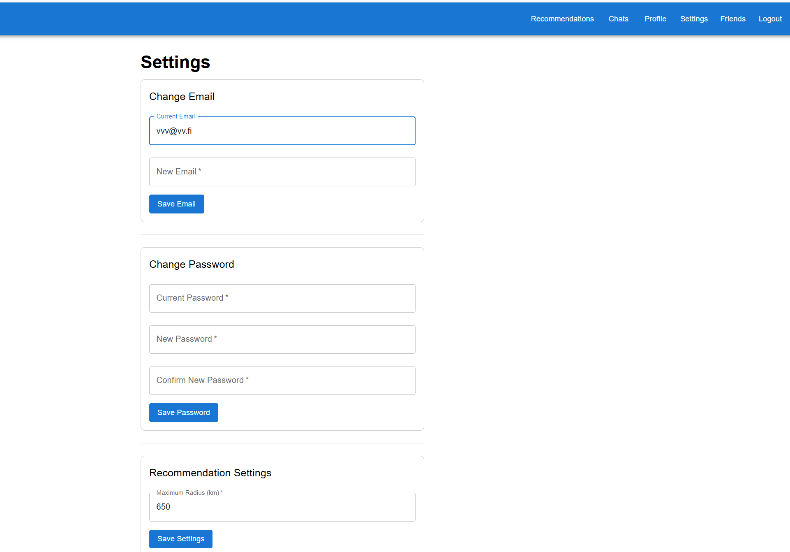

# Match Me - Meeting Application

> A modern meeting application with Go backend, React frontend and real-time communication via WebSockets and Redis.

<p align="center">
  <a href="#english">English</a> |
  <a href="#russian">Русский</a>
</p>

<a id="english"></a>
## Table of Contents

- [Technologies](#technologies)
- [Requirements](#requirements)
- [Installation and Setup](#installation-and-setup)
- [Project Structure](#project-structure)
- [API and Ports](#api-and-ports)
- [Development](#development)
- [Features](#features)
- [Setting Recommendation Radius](#setting-recommendation-radius)
- [Database Reset and Dummy User Generation](#database-reset-and-dummy-user-generation)
- [Registration and Authentication](#registration-and-authentication)
- [Recommendation Algorithm](#recommendation-algorithm)
- [FAQ](#faq)
- [Troubleshooting](#troubleshooting)
- [Architecture Overview](#architecture-overview)
- [Example Usage Scenarios](#example-usage-scenarios)
- [Environment Variables](#environment-variables)
- [Security](#security)

## Technologies

### Backend:
- **Go** - main development language
- **Gorilla Mux** - HTTP router
- **Gorilla WebSocket** - WebSocket support
- **GORM** - ORM for database operations
- **JWT** - user authentication
- **PostgreSQL** - data storage
- **Redis** - in-memory store for online presence and real-time features

### Frontend:
- **React** - UI library
- **React Router** - routing
- **Material UI** - interface components
- **Formik** and **Yup** - form management and validation
- **Axios** - HTTP client
- **React Toastify** - notifications

### Infrastructure:
- **Docker** and **Docker Compose** - containerization
- **Redis** (v7+) - required for presence and real-time features (auto-started via Docker Compose)
- **Concurrently** - parallel service execution

## Requirements

- **Node.js** (v16+)
- **Go** (v1.19+)
- **Docker** and **Docker Compose**
- **Redis** (v7+) — required for presence and real-time features (auto-started via Docker Compose)
- **WSL2** (for Windows) with Docker Desktop integration enabled

## Installation and Setup

### Environment Configuration

Before running the application, ensure that the `config_local.env` file is properly configured. This file contains essential environment variables such as:

- **SERVER_PORT**: The port on which the backend server will run.
- **WEBSOCKET_PORT**: The port for WebSocket connections.
- **DATABASE_URL**: Connection string for the PostgreSQL database.
- **JWT_SECRET**: Secret key for signing JWT tokens.
- **JWT_EXPIRES_IN**: Expiration time for JWT tokens.
- **MEDIA_UPLOAD_DIR**: Directory for storing uploaded media files.
- **ENVIRONMENT**: The environment mode (e.g., development, production).
- **ALLOWED_ORIGINS**: Comma-separated list of allowed origins for CORS.
- **LOG_LEVEL**: Logging level (e.g., debug, info, warn, error).
- **REDIS_URL**: Redis connection string (default: `localhost:6379`).
- **REDIS_TIMEOUT**: Redis connection timeout (seconds).

Ensure these variables are updated according to your local setup.

### Automatic Installation (Recommended)

1. Clone the repository:
   ```bash
   git clone https://github.com/ihorshaposhnik/m.git
   cd m
   ```

2. Make the setup script executable:
   ```bash
   chmod +x setup.sh
   ```

3. Run the setup script:
   ```bash
   ./setup.sh
   ```
   The script will automatically configure everything needed: install Docker (if missing), create PostgreSQL and Redis containers, install dependencies for both backend and frontend.

4. After installation is complete, start the application:
   ```bash
   npm run dev
   ```

5. Open the application in your browser:
   - Frontend: [http://localhost:3000](http://localhost:3000)
   - Backend API: [http://localhost:8080](http://localhost:8080)

### Manual Installation

If automatic installation doesn't suit your needs, perform these steps manually:

1. Install Docker and Docker Compose
2. Start PostgreSQL and Redis:
   ```bash
   docker compose up -d db redis
   ```
3. Install backend dependencies:
   ```bash
   cd backend
   go mod tidy
   go run main.go -deps
   cd ..
   ```
4. Install frontend dependencies:
   ```bash
   cd frontend
   npm install
   cd ..
   ```
5. Start the application:
   ```bash
   npm run dev
   ```

**Note:** Redis is started automatically with Docker Compose. If running services separately, ensure Redis is running and accessible at the address specified in `REDIS_URL`.

### Docker Installation

For setting up Docker on different operating systems, follow these steps:

1. **Windows**:
   - Install Docker Desktop from the [official website](https://www.docker.com/products/docker-desktop).
   - Enable WSL2 integration in Docker Desktop settings.
   - Start Docker Desktop to use Docker in WSL2.

2. **macOS**:
   - Install Docker Desktop for Mac from the [official website](https://www.docker.com/products/docker-desktop).
   - Start Docker Desktop to use Docker in the terminal.

3. **Linux**:
   - Install Docker using your distribution's package manager (e.g., `apt` for Ubuntu).
   - Ensure Docker is running as a daemon.
   - Use Docker commands in the terminal as usual.

## Project Structure

```
match-me/m
├── backend/              # Go server
│   ├── config/           # Configuration
│   ├── controllers/      # API controllers
│   ├── db/               # Database settings
│   ├── middleware/       # Middleware (auth, etc.)
│   ├── models/           # Data models
│   ├── routes/           # API routes
│   ├── services/         # Business logic (recommendations, presence, etc.)
│   │   └── presence.go   # Online presence logic (Redis)
│   ├── sockets/          # WebSocket handlers (real-time chat, notifications)
│   ├── static/           # Static files (images)
│   ├── utils/            # Helper functions
│   ├── go.mod            # Go dependencies
│   └── main.go           # Entry point
├── frontend/             # React application
│   ├── public/           # Static files
│   ├── src/              # React source code
│   ├── package.json      # NPM dependencies
│   └── package-lock.json # NPM lock file
├── docker-compose.yml    # Docker configuration (PostgreSQL, Redis)
├── package.json          # Root NPM scripts
└── setup.sh              # Setup script
```

## API and Ports

- **3000** - Frontend (React)
- **8080** - Backend API (Go)
- **8081** - WebSocket server
- **5433** - PostgreSQL
- **6379** - Redis

## Development

### Available Scripts

```bash
# Full installation
npm run all

# Run the entire application
npm run dev

# Database only
npm run dev:db

# Redis only
npm run dev:redis

# Backend only
npm run dev:backend

# Frontend only
npm run dev:frontend
```

### Working with the Database and Redis

To access PostgreSQL:

```bash
docker exec -it m_postgres psql -U user -d sopostavmenya
```

To access Redis CLI:

```bash
docker exec -it m_redis redis-cli
```

## Features

- **JWT Authentication**: Secure user authentication
- **WebSockets**: Real-time communication (chat, notifications)
- **Online Presence Tracking**: Real-time user online/offline status via Redis
- **Batch Presence API**: Efficiently check online status for multiple users
- **Real-time Notifications**: Instant updates for chat and social features via WebSocket and Redis
- **Image Upload**: Support for avatars and media content
- **Data Validation**: Strict validation of input data
- **Docker**: Easy deployment in any environment
- **CORS**: Configured security for cross-domain requests

## Setting Recommendation Radius

To search for recommendations within a specific geographical radius, navigate to the "Settings" page of the application. At the bottom of the settings page, you will find an option to set the maximum radius for recommendations. Adjusting this value enables proximity-based filtering for recommendations.


*Screenshot: Where to set the maximum recommendation radius in the Settings page*

## Database Reset and Dummy User Generation

These features are available only to the administrator via the admin panel in the frontend.

- To access the admin panel, log in with AdminEmail and the AdminPassword (specified in `config/constants.go`).
- The admin panel provides buttons for database reset (`/admin/reset-fixtures`) and dummy user generation (`/admin/generate-fixtures?num=N`).
- When resetting the database, the admin user is created automatically using the config data.

## Registration and Authentication

- Email must be in the format: example@domain.com
- Password must be at least 8 characters and contain both letters and numbers or special characters.
- After registration, fill in your profile completely to enable recommendations.

## Recommendation Algorithm

The recommendation system supports two independent modes:
- **Affinity**: Matches users by profile similarity (interests, hobbies, music, food, travel), with customizable field priorities.
- **Desire**: Matches users by the 'LookingFor' field (custom search).

**How it works:**
1. Only users within your preferred radius are considered (fast geospatial filtering via PostgreSQL earthdistance/cube).
2. Each candidate is scored by the overlap of profile fields. Each match gives +2%, priority match +4%. The score is capped at 100%.
3. Declined users and incomplete profiles are excluded.
4. Recommendations are sorted by distance (nearest first), then by match score (highest first).
5. The system is extensible: new fields and weights can be added by developers.

**Tip:** Set your search radius in Settings (recommended: 500–1000 km) and fill out your profile completely for best results.

_For developers: see the architectural comment in `backend/services/recommendations.go` for implementation details and extension points._

## FAQ

**Q: Why am I not getting any recommendations?**  
A: Please make sure your profile is fully filled out (name, city, bio, interests, etc.) and that you have set a search radius in your settings (recommended: 500–1000 km). If your radius is too small or your profile is incomplete, you may not receive any matches.

## Troubleshooting

- If you do not see any recommendations, check that your profile is complete and your search radius is set.
- If you encounter errors during registration or login, make sure your email and password meet the requirements.
- If you see errors related to Redis (e.g., presence not working, real-time features unavailable), ensure Redis is running and accessible at the address specified in `REDIS_URL`.
- For database reset or test user generation, use the admin panel (see instructions above).

## Architecture Overview

**System Components and Data Flow:**


*Legend:*
- **React App**: User interface, interacts with API and WebSocket.
- **Go HTTP API**: Handles REST endpoints, business logic, authentication.
- **WebSocket Server**: Real-time chat, notifications, presence updates.
- **Presence Service**: Tracks online status, uses Redis for fast access.
- **PostgreSQL**: Main data storage (users, profiles, messages, etc).
- **Redis**: In-memory store for online presence and real-time features.

*You can add a PNG/SVG diagram here if desired.*

## Example Usage Scenarios

### EN
- **User logs in and opens chat:**
  - The frontend establishes a WebSocket connection.
  - The backend marks the user as online in Redis.
  - Other users see this user as online in real time.
- **User sends a message:**
  - The message is sent via WebSocket to the backend.
  - The backend broadcasts the message to all chat participants.
  - All online users in the chat receive the message instantly.
- **User receives a real-time notification:**
  - When a new message or event occurs, the backend pushes a notification via WebSocket.
  - The frontend displays a toast or badge update immediately.
- **User goes offline:**
  - The WebSocket disconnects or the user logs out.
  - The backend removes the user's presence key from Redis.
  - Other users see the user as offline within seconds.

## Environment Variables

| Name                | Default           | Description (EN)                                 | Описание (RU)                                 |
|---------------------|-------------------|--------------------------------------------------|-----------------------------------------------|
| SERVER_PORT         | 8080              | Backend server port                              | Порт backend-сервера                          |
| WEBSOCKET_PORT      | 8081              | WebSocket server port                            | Порт WebSocket-сервера                        |
| DATABASE_URL        | postgres://...    | PostgreSQL connection string                     | Строка подключения к PostgreSQL               |
| JWT_SECRET          | verysecretkey     | JWT signing secret                               | Секрет для подписи JWT                        |
| JWT_EXPIRES_IN      | 60                | JWT expiration (minutes)                         | Время жизни JWT (минуты)                      |
| JWT_REFRESH_EXPIRES_IN | 10080           | Refresh token expiration (minutes)               | Время жизни refresh-токена (минуты)           |
| MEDIA_UPLOAD_DIR    | ./static/images   | Directory for uploaded images                    | Папка для загружаемых изображений             |
| ENVIRONMENT         | development       | Environment mode                                 | Режим работы приложения                       |
| ALLOWED_ORIGINS     | ...               | Allowed CORS origins (comma-separated)           | Разрешённые origin для CORS                   |
| LOG_LEVEL           | debug             | Logging level                                    | Уровень логирования                           |
| REDIS_URL           | localhost:6379    | Redis connection string                          | Строка подключения к Redis                    |
| REDIS_TIMEOUT       | 5                 | Redis connection timeout (seconds)               | Таймаут подключения к Redis (секунды)         |
| RECOMMENDATIONS_LIMIT | 10              | Max recommendations per request                  | Максимум рекомендаций за запрос               |
| POSTGRES_USER       | user              | PostgreSQL user                                  | Пользователь PostgreSQL                       |
| POSTGRES_PASSWORD   | password          | PostgreSQL password                              | Пароль PostgreSQL                             |
| POSTGRES_DB         | sopostavmenya     | PostgreSQL database name                         | Имя базы данных PostgreSQL                    |
| DB_PORT             | 5433              | PostgreSQL port                                  | Порт PostgreSQL                               |

## Security

### EN
- **Authentication:**
  - JWT tokens are used for stateless authentication.
  - Passwords are securely hashed with bcrypt and a unique salt per user.
  - Refresh tokens are supported for session renewal.
- **Authorization:**
  - All sensitive endpoints require authentication.
  - Users can only access their own data or data they are allowed to see.
  - User endpoints return HTTP 404 if the resource is not found or access is denied (prevents distinguishing between "not found" and "forbidden").
- **WebSocket:**
  - WebSocket connections require a valid JWT for handshake.
  - All real-time events are scoped to authenticated users.
- **Redis:**
  - Used only for presence (online status), does not store sensitive data.
  - No direct user access to Redis.
- **CORS:**
  - Only allowed origins can access the API and WebSocket.
- **Docker & Secrets:**
  - Secrets and credentials are managed via environment variables, not hardcoded.
  - No secrets are committed to the repository.
- **Compliance:**
  - The application is secure. Information is only shown to the correct authenticated users.
  - Passwords are protected with bcrypt+salt.
  - Endpoints return 404 for both non-existent and forbidden resources, preventing information leaks.
  - No private data is leaked via API or logs.

---

<a id="russian"></a>
# Match Me - Приложение для знакомств

> Современное приложение для знакомств с бэкендом на Go, фронтендом на React и поддержкой общения в реальном времени через WebSockets и Redis.

## Содержание

- [Технологии](#технологии)
- [Требования](#требования)
- [Установка и запуск](#установка-и-запуск)
- [Структура проекта](#структура-проекта)
- [API и порты](#api-и-порты)
- [Разработка](#разработка)
- [Особенности](#особенности)
- [Настройка радиуса для рекомендаций](#настройка-радиуса-для-рекомендаций)
- [Сброс базы данных и генерация фиктивных пользователей](#сброс-базы-данных-и-генерация-фиктивных-пользователей)
- [Регистрация и авторизация](#регистрация-и-авторизация)
- [Алгоритм рекомендаций](#алгоритм-рекомендаций)
- [FAQ](#faq)
- [Решение проблем](#решение-проблем)
- [Обзор архитектуры](#обзор-архитектуры)
- [Примеры сценариев использования](#примеры-сценариев-использования)
- [Переменные окружения](#переменные-окружения)
- [Безопасность](#безопасность)

## Технологии

### Backend:
- **Go** - основной язык разработки
- **Gorilla Mux** - HTTP маршрутизатор
- **Gorilla WebSocket** - поддержка WebSocket
- **GORM** - ORM для работы с базой данных
- **JWT** - аутентификация пользователей
- **PostgreSQL** - хранение данных
- **Redis** - in-memory хранилище для онлайн-статуса и real-time функций

### Frontend:
- **React** - UI библиотека
- **React Router** - маршрутизация
- **Material UI** - компоненты интерфейса
- **Formik** и **Yup** - управление формами и валидация
- **Axios** - HTTP клиент
- **React Toastify** - уведомления

### Инфраструктура:
- **Docker** и **Docker Compose** - контейнеризация
- **Redis** (v7+) - необходим для presence и real-time функций (автоматически запускается через Docker Compose)
- **Concurrently** - параллельный запуск сервисов

## Требования

- **Node.js** (v16+)
- **Go** (v1.19+)
- **Docker** и **Docker Compose**
- **Redis** (v7+) — необходим для presence и real-time функций (автоматически запускается через Docker Compose)
- **WSL2** (для Windows) с включенной интеграцией Docker Desktop

## Установка и запуск

### Конфигурация окружения

Перед запуском приложения убедитесь, что файл `config_local.env` правильно настроен. Этот файл содержит важные переменные окружения, такие как:

- **SERVER_PORT**: Порт, на котором будет работать сервер.
- **WEBSOCKET_PORT**: Порт для WebSocket соединений.
- **DATABASE_URL**: Строка подключения к базе данных PostgreSQL.
- **JWT_SECRET**: Секретный ключ для подписи JWT токенов.
- **JWT_EXPIRES_IN**: Время истечения JWT токенов.
- **MEDIA_UPLOAD_DIR**: Директория для хранения загружаемых медиафайлов.
- **ENVIRONMENT**: Режим работы приложения (например, development, production).
- **ALLOWED_ORIGINS**: Список разрешенных источников для CORS.
- **LOG_LEVEL**: Уровень логирования (например, debug, info, warn, error).
- **REDIS_URL**: строка подключения к Redis (по умолчанию: `localhost:6379`)
- **REDIS_TIMEOUT**: таймаут подключения к Redis (секунды)

	Убедитесь, что эти переменные обновлены в соответствии с вашей локальной конфигурацией.

### Автоматическая установка (рекомендуется)

1. Клонируйте репозиторий:
   ```bash
   git clone https://github.com/ihorshaposhnik/m.git
   cd m
   ```

2. Сделайте скрипт установки исполняемым:
   ```bash
   chmod +x setup.sh
   ```

3. Запустите скрипт установки:
   ```bash
   ./setup.sh
   ```
   Скрипт автоматически настроит все необходимое: установит Docker (если отсутствует), создаст контейнеры PostgreSQL и Redis, установит зависимости для backend и frontend.

4. После завершения установки запустите приложение:
   ```bash
   npm run dev
   ```

5. Откройте приложение в браузере:
   - Frontend: [http://localhost:3000](http://localhost:3000)
   - Backend API: [http://localhost:8080](http://localhost:8080)

### Ручная установка

Если автоматическая установка не подходит, выполните шаги вручную:

1. Установите Docker и Docker Compose
2. Запустите PostgreSQL и Redis:
   ```bash
   docker compose up -d db redis
   ```
3. Установите зависимости для backend:
   ```bash
   cd backend
   go mod tidy
   go run main.go -deps
   cd ..
   ```
4. Установите зависимости для frontend:
   ```bash
   cd frontend
   npm install
   cd ..
   ```
5. Запустите приложение:
   ```bash
   npm run dev
   ```

**Примечание:** Redis запускается автоматически через Docker Compose. Если сервисы запускаются отдельно, убедитесь, что Redis работает и доступен по адресу, указанному в `REDIS_URL`.

### Docker Installation for Different Operating Systems

1. **Windows**:
   - Установите Docker Desktop с [официального сайта](https://www.docker.com/products/docker-desktop).
   - Включите интеграцию с WSL2 в настройках Docker Desktop.
   - Запустите Docker Desktop, чтобы использовать Docker в WSL2.

2. **macOS**:
   - Установите Docker Desktop для Mac с [официального сайта](https://www.docker.com/products/docker-desktop).
   - Запустите Docker Desktop, чтобы использовать Docker в терминале.

3. **Linux**:
   - Установите Docker через пакетный менеджер вашей дистрибуции (например, `apt` для Ubuntu).
   - Убедитесь, что Docker запущен как демон.
   - Используйте команды Docker в терминале, как обычно.

## Структура проекта

```
match-me/m
├── backend/              # Go сервер
│   ├── config/           # Конфигурация
│   ├── controllers/      # Контроллеры API
│   ├── db/               # Настройки базы данных
│   ├── middleware/       # Промежуточное ПО (авторизация и т.д.)
│   ├── models/           # Модели данных
│   ├── routes/           # Маршруты API
│   ├── services/         # Бизнес-логика (рекомендации, presence и др.)
│   │   └── presence.go   # Логика онлайн-статуса (Redis)
│   ├── sockets/          # WebSocket обработчики (чат, уведомления)
│   ├── static/           # Статические файлы (изображения)
│   ├── utils/            # Вспомогательные функции
│   ├── go.mod            # Go зависимости
│   └── main.go           # Точка входа
├── frontend/             # React приложение
│   ├── public/           # Статические файлы
│   ├── src/              # Исходный код React
│   ├── package.json      # NPM зависимости
│   └── package-lock.json # Лок-файл NPM
├── docker-compose.yml    # Конфигурация Docker (PostgreSQL, Redis)
├── package.json          # Корневые NPM скрипты
└── setup.sh              # Скрипт установки
```

## API и порты

- **3000** - Frontend (React)
- **8080** - Backend API (Go)
- **8081** - WebSocket сервер
- **5433** - PostgreSQL
- **6379** - Redis

## Разработка

### Доступные скрипты

```bash
# Полная установка
npm run all

# Запуск всего приложения
npm run dev

# Только база данных
npm run dev:db

# Только Redis
npm run dev:redis

# Только backend
npm run dev:backend

# Только frontend
npm run dev:frontend
```

### Работа с базой данных и Redis

Для доступа к PostgreSQL:

```bash
docker exec -it m_postgres psql -U user -d sopostavmenya
```

Для доступа к Redis CLI:

```bash
docker exec -it m_redis redis-cli
```

## Особенности

- **JWT аутентификация**: Безопасная аутентификация пользователей
- **WebSockets**: Общение в реальном времени (чат, уведомления)
- **Отслеживание онлайн-статуса**: Мгновенное определение, кто онлайн, через Redis
- **Массовая проверка статуса**: Быстрый API для проверки онлайн-статуса сразу нескольких пользователей
- **Мгновенные уведомления**: Реализация real-time событий через WebSocket и Redis
- **Загрузка изображений**: Поддержка аватаров и медиа-контента
- **Валидация данных**: Строгая проверка вводимых данных
- **Docker**: Простое развертывание в любой среде
- **CORS**: Настроена безопасность для междоменных запросов

## Настройка радиуса для рекомендаций

Для поиска рекомендаций в определённом географическом радиусе перейдите на страницу "Настройки" приложения. Внизу страницы настроек вы найдёте опцию для установки максимального радиуса рекомендаций. Настройка этого значения позволяет использовать фильтрацию по близости для рекомендаций.


*Скриншот: Где установить максимальный радиус рекомендаций на странице настроек*

## Сброс базы данных и генерация фиктивных пользователей

Эти функции доступны только для администратора через админ-панель на фронтенде.

	- Для доступа к админ-панели войдите с AdminEmail и паролем администратора AdminPassword (указаны в config/constants.go).
	- В админ-панели доступны кнопки для сброса базы (`/admin/reset-fixtures`) и генерации фиктивных пользователей (`/admin/generate-fixtures?num=N`).
	- При сбросе базы админ создаётся автоматически с данными из конфига.

## Регистрация и авторизация

- Email должен быть в формате: example@domain.com
- Пароль — не менее 8 символов, обязательно должны быть и буквы, и цифры или специальные символы.
- После регистрации обязательно заполните профиль, чтобы получать рекомендации.

## Алгоритм рекомендаций

Система поддерживает два независимых режима:
- **Affinity**: подбор по схожести профиля (интересы, хобби, музыка, еда, путешествия) с возможностью приоритизации полей.
- **Desire**: подбор по полю 'Кого ищу' (кастомный поиск).

**Как это работает:**
1. В расчет берутся только пользователи в пределах заданного радиуса (быстрая геофильтрация через PostgreSQL earthdistance/cube).
2. Каждому кандидату начисляются баллы за совпадения в полях профиля: обычное совпадение +2%, приоритетное +4%, максимум 100%.
3. Отклонённые пользователи и незаполненные профили исключаются.
4. Рекомендации сортируются сначала по расстоянию (ближе — выше), затем по проценту совпадения.
5. Архитектура расширяема: разработчики могут добавлять новые поля и веса.

**Совет:** Установите радиус поиска в настройках (рекомендуется 500–1000 км) и полностью заполните профиль для лучших результатов.

_Для разработчиков: подробности реализации и расширения — в архитектурном комментарии `backend/services/recommendations.go`._

## FAQ

**В: Почему мне не приходят рекомендации?**  
О: Убедитесь, что ваш профиль полностью заполнен (имя, город, биография, интересы и т.д.), а также что в настройках установлен радиус поиска (рекомендуется 500–1000 км). Если радиус слишком мал или профиль не заполнен, рекомендации могут не появиться.

## Решение проблем

- Если вы не видите рекомендаций, проверьте заполненность профиля и установленный радиус поиска.
- Если возникают ошибки при регистрации или входе, убедитесь, что email и пароль соответствуют требованиям.
- Если видите ошибки, связанные с Redis (например, не работает presence или real-time функции недоступны), убедитесь, что Redis запущен и доступен по адресу, указанному в `REDIS_URL`.
- Для сброса базы данных или генерации тестовых пользователей используйте админ-панель (см. инструкции выше).

## Обзор архитектуры

**Компоненты системы и потоки данных:**


*Легенда:*
- **React-приложение**: пользовательский интерфейс, взаимодействует с API и WebSocket.
- **Go HTTP API**: REST-эндпоинты, бизнес-логика, аутентификация.
- **WebSocket сервер**: чат, уведомления, обновления presence в реальном времени.
- **Сервис presence**: отслеживает онлайн-статус, использует Redis для быстрого доступа.
- **PostgreSQL**: основное хранилище данных (пользователи, профили, сообщения и др.).
- **Redis**: in-memory хранилище для онлайн-статуса и real-time функций.

*При желании можно добавить PNG/SVG-схему.*

## Примеры сценариев использования

- **Пользователь заходит в чат:**
  - Фронтенд устанавливает WebSocket-соединение.
  - Бэкенд отмечает пользователя как онлайн в Redis.
  - Остальные пользователи видят его онлайн в реальном времени.
- **Пользователь отправляет сообщение:**
  - Сообщение отправляется через WebSocket на бэкенд.
  - Бэкенд рассылает сообщение всем участникам чата.
  - Все онлайн-участники получают сообщение мгновенно.
- **Пользователь получает уведомление:**
  - При новом сообщении или событии бэкенд отправляет уведомление через WebSocket.
  - Фронтенд сразу показывает toast или обновляет бейджик.
- **Пользователь выходит из сети:**
  - WebSocket разрывается или пользователь выходит из аккаунта.
  - Бэкенд удаляет ключ presence из Redis.
  - Остальные видят, что пользователь оффлайн, в течение нескольких секунд.

## Переменные окружения

| Имя                 | Значение по умолчанию | Описание                                      |
|---------------------|----------------------|-----------------------------------------------|
| SERVER_PORT         | 8080                 | Порт backend-сервера                          |
| WEBSOCKET_PORT      | 8081                 | Порт WebSocket-сервера                        |
| DATABASE_URL        | postgres://...       | Строка подключения к PostgreSQL               |
| JWT_SECRET          | verysecretkey        | Секрет для подписи JWT                        |
| JWT_EXPIRES_IN      | 60                   | Время жизни JWT (минуты)                      |
| JWT_REFRESH_EXPIRES_IN | 10080              | Время жизни refresh-токена (минуты)           |
| MEDIA_UPLOAD_DIR    | ./static/images      | Папка для загружаемых изображений             |
| ENVIRONMENT         | development          | Режим работы приложения                       |
| ALLOWED_ORIGINS     | ...                  | Разрешённые origin для CORS                   |
| LOG_LEVEL           | debug                | Уровень логирования                           |
| REDIS_URL           | localhost:6379       | Строка подключения к Redis                    |
| REDIS_TIMEOUT       | 5                    | Таймаут подключения к Redis (секунды)         |
| RECOMMENDATIONS_LIMIT | 10                 | Максимум рекомендаций за запрос               |
| POSTGRES_USER       | user                 | Пользователь PostgreSQL                       |
| POSTGRES_PASSWORD   | password             | Пароль PostgreSQL                             |
| POSTGRES_DB         | sopostavmenya        | Имя базы данных PostgreSQL                    |
| DB_PORT             | 5433                 | Порт PostgreSQL                               |

## Безопасность

- **Аутентификация:**
  - Для аутентификации используются JWT-токены.
  - Пароли хранятся только в виде хэша (bcrypt + уникальная соль).
  - Поддерживаются refresh-токены для продления сессии.
- **Авторизация:**
  - Все чувствительные эндпоинты требуют авторизации.
  - Пользователь может получить только свои данные или те, к которым у него есть доступ.
  - Эндпоинты возвращают HTTP 404, если ресурс не найден или нет доступа (невозможно отличить "нет такого" от "нет доступа").
- **WebSocket:**
  - Для подключения по WebSocket требуется валидный JWT.
  - Все real-time события доступны только авторизованным пользователям.
- **Redis:**
  - Используется только для presence (онлайн-статуса), не хранит чувствительные данные.
  - Прямого доступа пользователей к Redis нет.
- **CORS:**
  - Только разрешённые origin могут обращаться к API и WebSocket.
- **Docker и секреты:**
  - Все секреты и пароли задаются через переменные окружения, не хардкодятся.
  - Секреты не коммитятся в репозиторий.
- **Соответствие требованиям:**
  - Приложение безопасно. Информация показывается только авторизованным пользователям.
  - Пароли защищены через bcrypt+соль.
  - Эндпоинты возвращают 404 и для несуществующих, и для запрещённых ресурсов, чтобы не было утечек.
  - Приватные данные не попадают в API и логи.

---